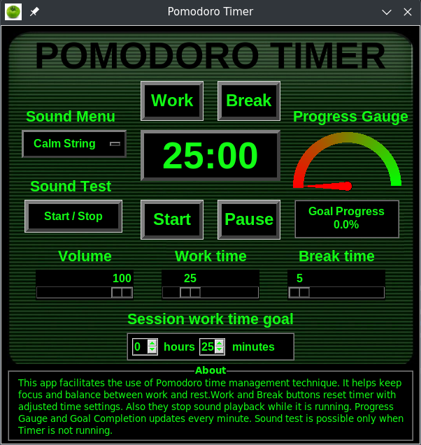

# Pomodoro Timer
#### 🎥 [Video Demo](https://www.youtube.com/watch?v=E0uw6VHA5fI)

### 🖼️ Application Preview

---

### 💡 Why I Created This

The Pomodoro Timer is designed for anyone looking to boost productivity and stay focused. It's based on the **Pomodoro Technique**, developed by Francesco Cirillo in the late 1980s. The core ideas behind the technique are:

1. Estimate how much time a task will take.
2. Stay focused while completing it.
3. Take breaks to clear your mind.
4. Track time spent on both tasks and breaks.
5. Review progress regularly.
6. Use these patterns to achieve personal or professional goals.

---

### ⚙️ Platform & Dependencies

This version was built using:
- **Debian 12**
- **Python 3.11.8**
- **Pygame 2.6.1** (for sound playback)
- **Tkinter** (Python's built-in GUI library)
- Standard libraries: `pathlib`, `math`, `platform`

The app was created with cross-platform compatibility in mind.

---

### ⏱️ Features

- **Pomodoro-style timer** for work and breaks
- Tracks:
  - Work time
  - Break time
  - Total time per session
- **Sound alerts** (user-selectable)
  - Sound menu to choose audio clips
  - Volume control slider
  - Sound test button
- **Session goal tracking**
  - Progress bar updates every minute
  - Spinboxes for setting session goals
- **Customizable timing**
  - Sliders for setting work and break durations
  - Timer can be started with new settings each time
- **Start/Stop/Reset** controls

---

### 🚧 Future Development Ideas

The Pomodoro Timer was built with extensibility in mind. Here are some potential future improvements:

- Refactor using **Object-Oriented Programming**
- Display **total work and break time**
- **Auto-start timer** checkbox
- **User authentication**
- cloud-based **activity tracking**
- **Save user settings**
- **Time-based charts**
- **Analytics and reporting**

---

### 🧠 Final Thoughts

This is more than a timer — it's a step toward building smarter productivity tools. Feel free to fork, contribute, or just use it to power through your tasks!
